# [fit]Automatiza tu flow en
# [fit]iOS


Jorge Maroto García
*@patoroco*


^ Desde 2010 haciendo apps para iOS
^ Casi 2 años en ticketea
^ Actualmente el equipo de iOS es de 2 personas
^ nueva app de iOS / android en react-native
^ importancia de automatizar


---


^ fastlane es una suite de utilidades escrita en ruby para ejecutar tareas.
^ al principio se quería automatizar el manejo de info de itunes connect, pero poco a poco se han ido añadiendo más utilidades específicas.


---


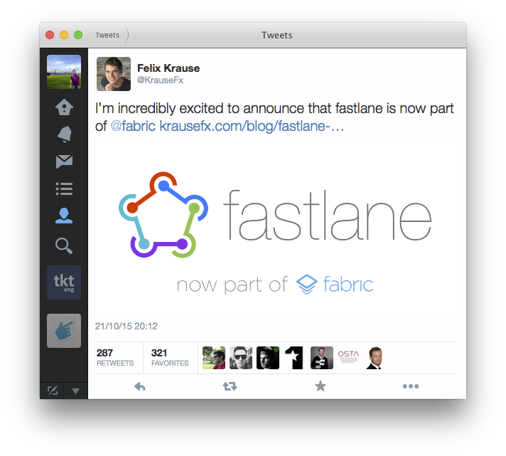

^ esta charla se llamaba automatiza tu flow en ios, pero el 10 de noviembre se anunció que fastlane pasaba a ser parte de fabric


---

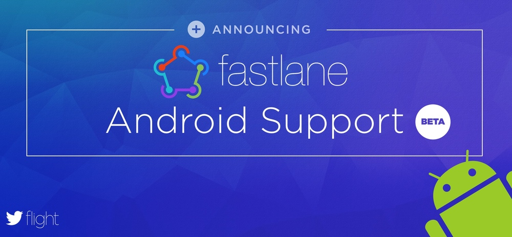

---


# [fit]Automatiza tu flow en
# [fit]~~iOS~~ *mobile*

Jorge Maroto García
*@patoroco*


---


^ el nombre de fastlane significa carril o vía rápida, y hace honor a su nombre, ya que permite crear flujos o 'lanes' a nuestro antojo.

^ (explicar flujos)

^ después explicaré cada brevemente cada herramienta


---


^ fastlane en un principio se creó para interactuar con iTunes Connect usando técnicas de scrapping.

^ en mayo se añadió a la suite spaceship, una especie de apiclient para interactuar con el portal de desarrolladores de Apple.

^ poco a poco todos los proyectos han ido migrando del scrapping a medida, a utilizar spaceship como core.


---


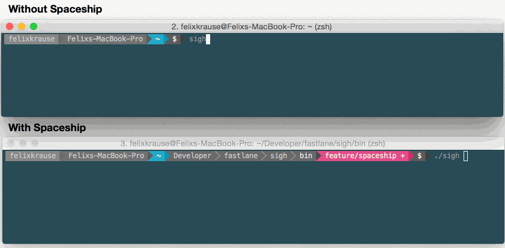

^ aquí se ve una comparativa utilizando sigh, la herramienta del manejo de provisionings de la suite.
^ arriba mediante el antiguo scrapping, y abajo haciendo uso de spaceship


---


^ aunque spaceship es la parte core de fastlane, no es lo habitual interactuar directamente con esta gema, aunque se puede utilizar para aplicaciones de ruby.

^ voy a presentar brevemente las herramientas que componen esta suite y luego iremos viendo su uso en un proyecto real


---


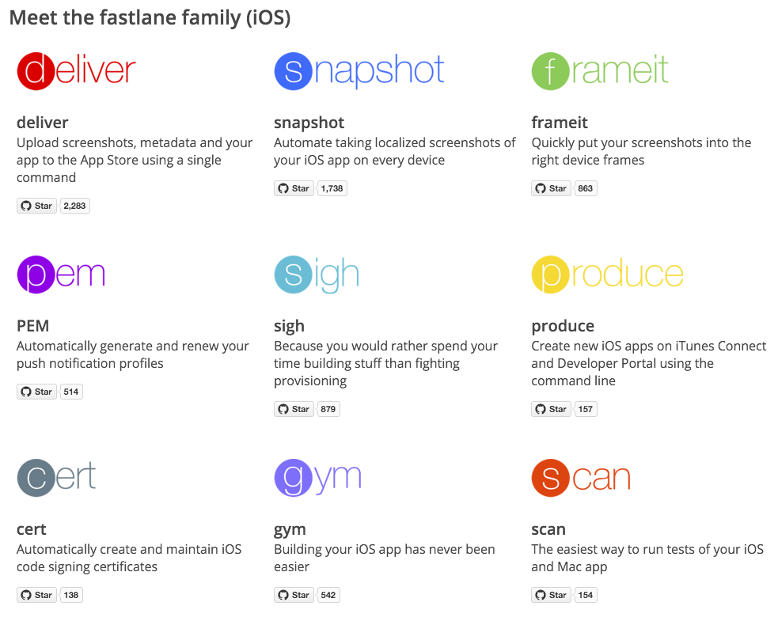

^ Por un lado tenemos las herramientas exclusivas para iOS

^ (explicar una a una)


---


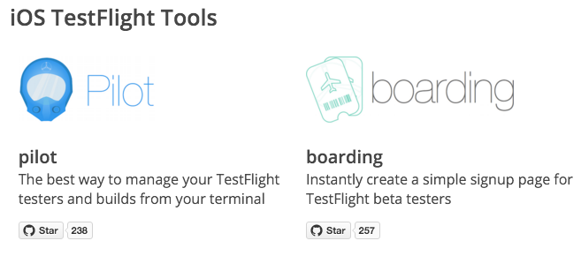

^ Otras herramientas relacionadas con la subida a testfligth


---


^ como decía antes, desde octubre existe el soporte para android. No lo he probado, pero según comenta, equivale a deliver, pero para el Google Play


---


#and more ...
#[fit]https://github.com/fastlane/

^ además de todas estas herramientas "grandes", en el repo de github existen algunas otras utilidades como watchbuild, que avisa de cuando se quita el estado de processing de itunes connect, o el gestor de keychain donde se almacenan passwords y demás


---


### _Install_

#[fit]_`gem install fastlane`_


^ para instalarlo, únicamente es hacer un gem install, y como es habitual, esto descargará todas las subherramientas de la suite (que son unas cuantas).

^ dado que fastlane y sus dependencias suele cambiar bastante, es una buena práctica tener un fichero Gemfile e instalar con bundle para que todos en el proyecto estén en las mismas versiones.


---


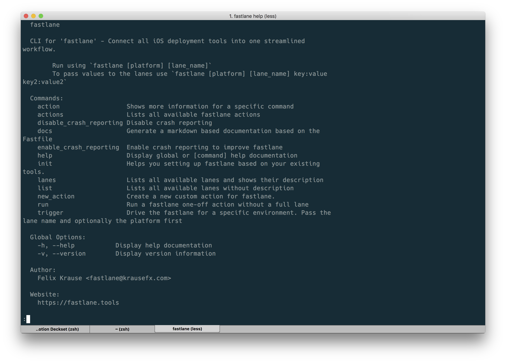

^ como es habitual, podemos ejecutar fastlane help para ver los comandos disponibles. Remarcar que CADA comando, cada acción o cada parámetro están documentados.

^ ahora voy a hacer un proceso completo de ejemplo para ver las opciones de las herramientas


---


#[fit]`fastlane init`

^ para empezar, haremos un fastlane init

---


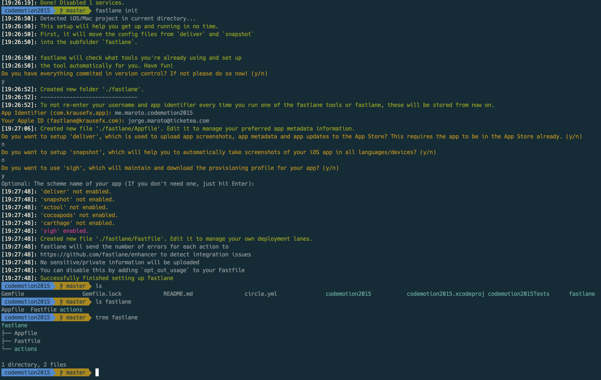

^ como véis, nos pregunta varias veces por si queremos configurar alguna herramienta durante el proceso. En un primer momento, con lo básico me servía, así que solo introduje mi correo y el bundle de la app.


---


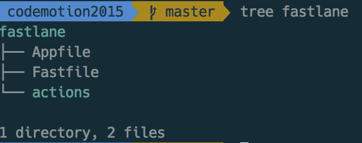

^ tras terminar el proceso, tenemos un fichero AppFile, un FastFile y una carpeta vacía de actions


---


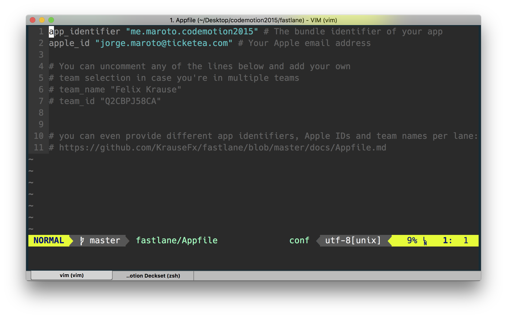

^ el appfile contiene el bundle y el apple id que usaremos para todas las acciones de fastlane.
^ es posible especificar estos datos cada vez que lancemos las acciones, o incluso utilizar un fichero .env, pero quería un caso muy sencillo y por eso lo puse aquí.


---


# [fit] Fastfile

```ruby
lane :test do
	xctest( destination: "name=iPad 2" )
end
```


^ el otro fichero que se crea es el fastfile, y este es el fichero central que utilizará fastfile.

^ en él se definen las diferentes lanes, que si recordamos de antes, eran el conjunto de pasos a hacer.


---


# [fit] DSL

^ El contenido de cada una de las lanes que creemos trata de ser un Domain Specific Language o DSL, es decir, utilizando un metalenguaje sobre Ruby en este caso, expresaremos las acciones que necesitemos.


---

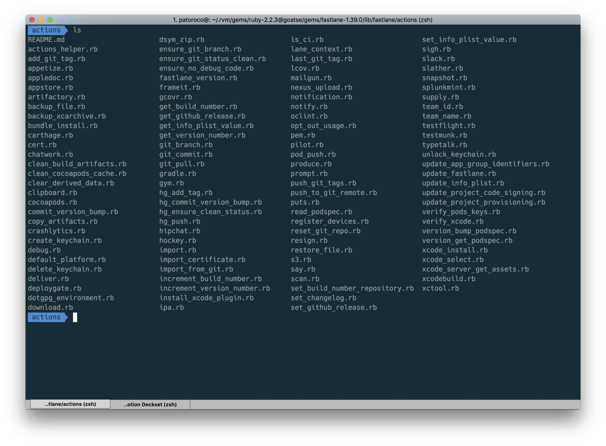

#[fit] **actions**

`fastlane actions`

^ Ejecutando fastlane actions, veremos un listado de las acciones que hay disponibles

---


---


# Total 120 actions <sub>(27/11/2015)</sub>

### https://github.com/fastlane/fastlane/tree/master/lib/fastlane/actions

### https://github.com/fastlane/fastlane/blob/master/docs/Actions.md


^ A día de hoy, hay 120 acciones publicadas, y si recordamos al hacer el fastlane init, nos ha creado una carpeta actions, donde podremos meter las acciones particulares de nuestro proyecto.


---

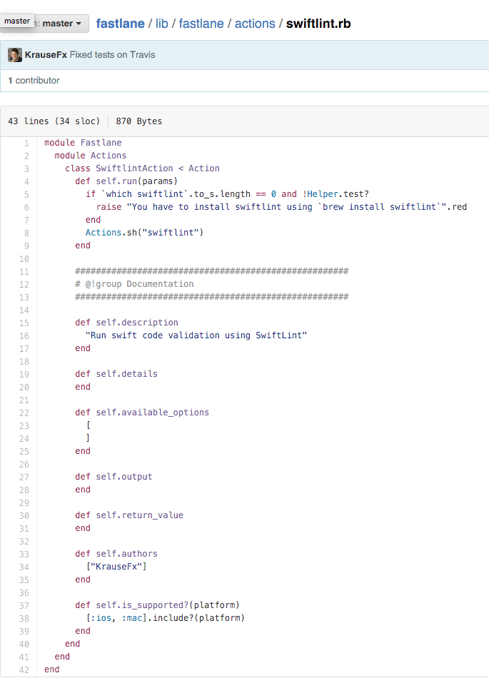

---


# Example _crashlytics_

`fastlane action crashlytics`

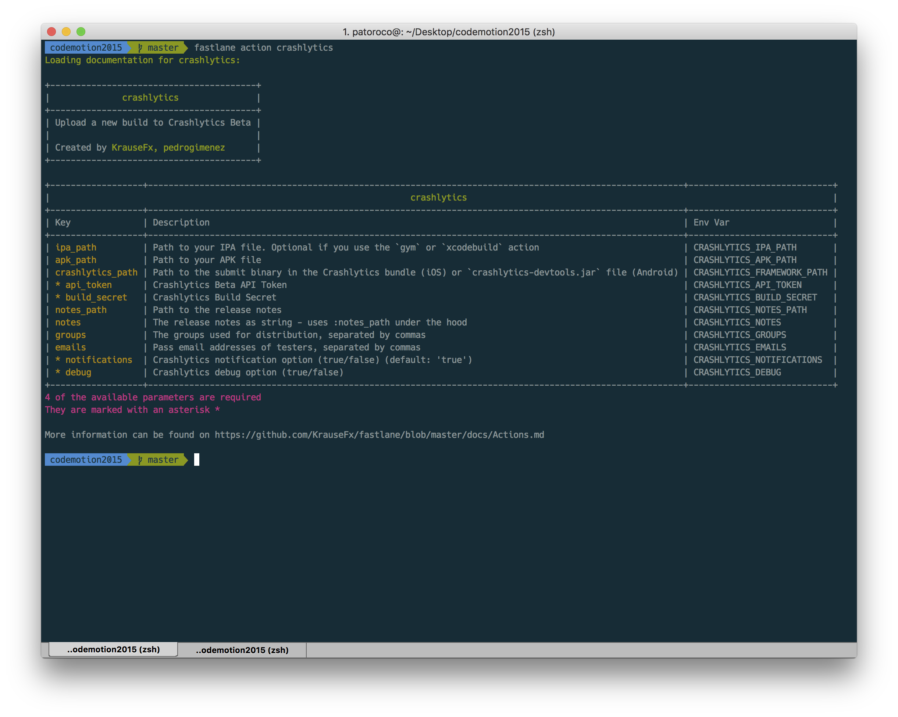


---


^ estos son los parámetros que admite la acción de crashlytics


---

# Example _crashlytics_


```ruby
lane :crashlytics do
  ipa( configuration: "Crashlytics" )
  crashlytics({
    ipa_path: Actions.lane_context[Actions::SharedValues::IPA_OUTPUT_PATH],
    groups: "Ticketea",
    notifications: "YES",
    notes_path: "./fastlane/crashlytics.txt"
  })

  slack({
    message: "Nueva versión de prueba de Box Office",
    channel: "@javiche",
    default_payloads: []
  })
end

```

---


```ruby

fastlane_version "1.41.1"

default_platform :ios

platform :ios do
  desc "Create app on iTunes Connect"
  lane :create_app do
    # be carefull with produce action, because apps created can't be deleted
    # from iTunes Connect (thanks Apple)
    produce(
      app_identifier: 'me.maroto.codemotion20152',
      app_name: 'prueba codemotion',
      language: 'Spanish',
      app_version: '1.0',
      sku: 'CODE20155', # if SKU is not specified, it will use a random one
    )
  end

  desc "Update certificates and use it on provisioning profiles"
  lane :update_certs do
    cert
    sigh(force: true)
  end
  
  ...
end

```

#[fit]https://github.com/patoroco/codemotion2015/blob/master/fastlane/Fastfile


^ esto es un fragmento del fastfile que utilizaré para la demo. Se pueden ver dos lanes, con su descripción y acciones en su interior.


---


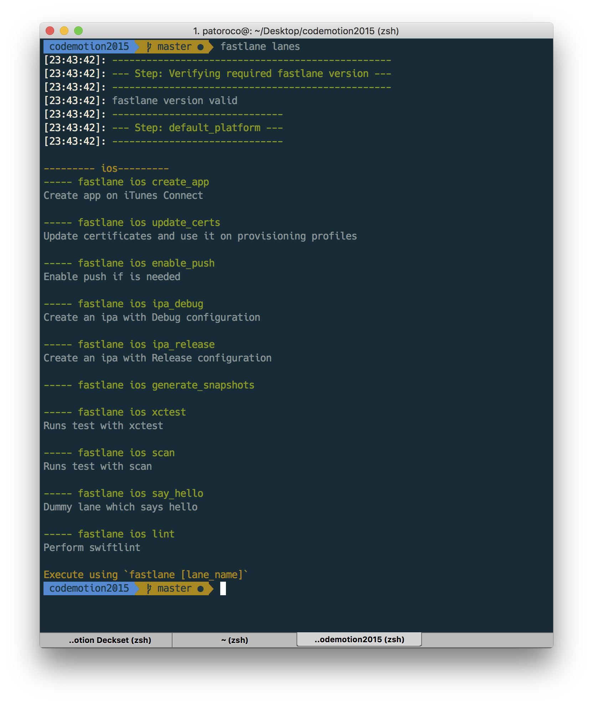

^ Si ejecutamos `fastlane lanes`, se nos mostrará un listado de todas las lanes disponible junto con sus descripciones


---


#[fit]Full flow

---


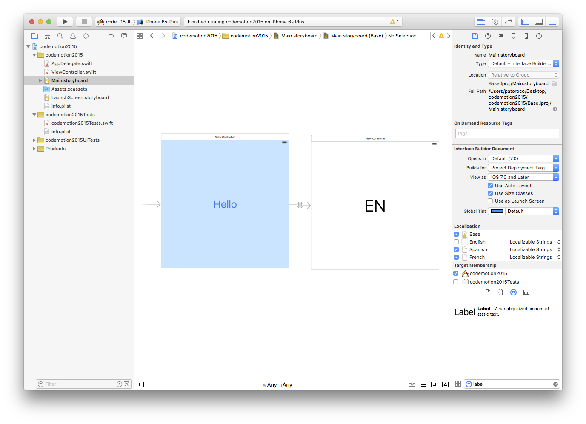

^ Esta es la aplicación que utilizaré para el ejemplo. Como se ve, únicamente son dos viewcontrollers unidos.

^ Remarcar también que hay un botón y una etiqueta que están localizadas en inglés, castellano y francés.


---


^ empecemos creando la app en iTunes Connect

---


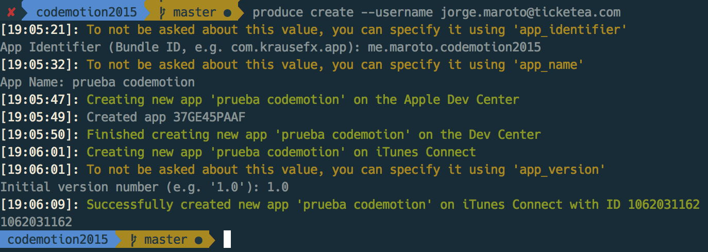

^ comando de creación de una app en itunes connect. Pasando parámetros por consola. Como se ve, no pide pass pq estaba ya guardado


---


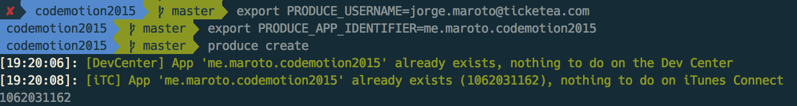

^ podríamos intentar crearlo con variables de entorno también. Se ve que no deja


---

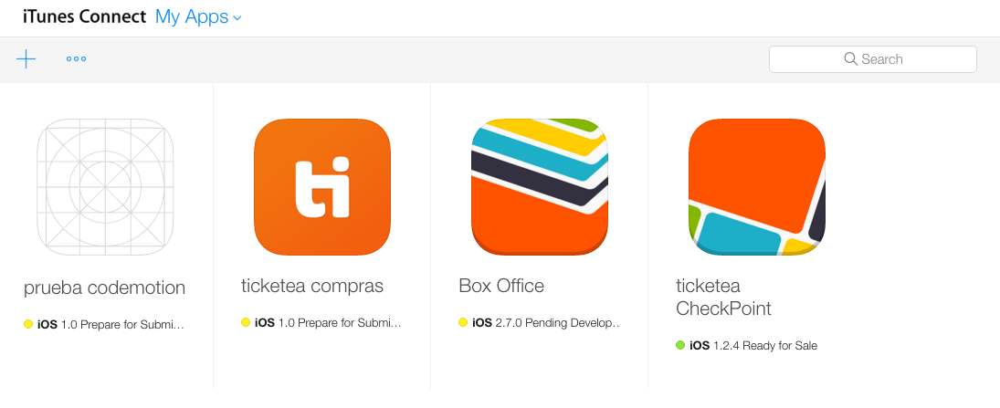

^ si entramos a itunes connect, veremos la app recién creada


---


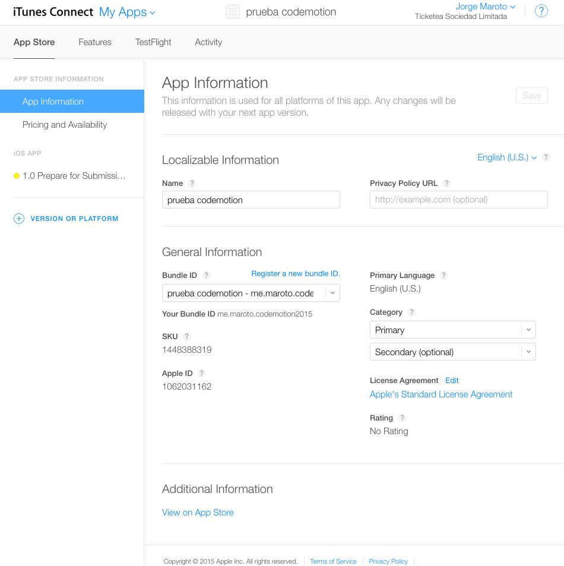

^ y esto dentro, con el sku generado para este bundle


---

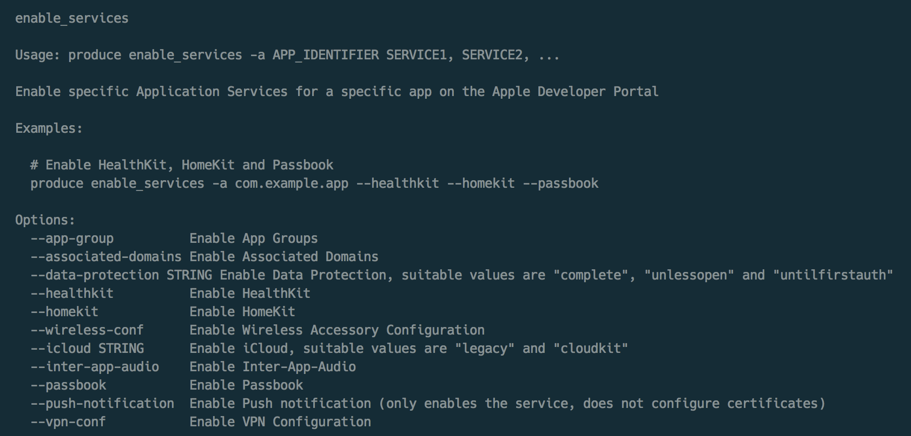

^ produce tiene otras acciones, como activar o desactivar servicios 


---


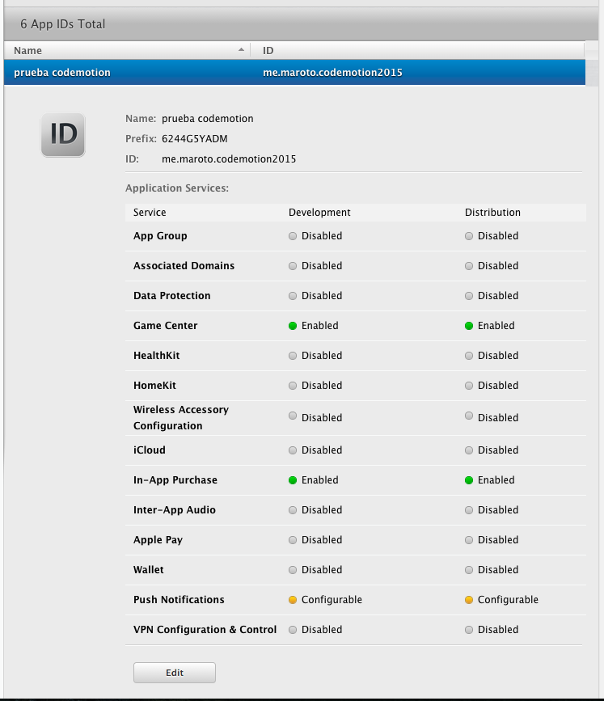


---


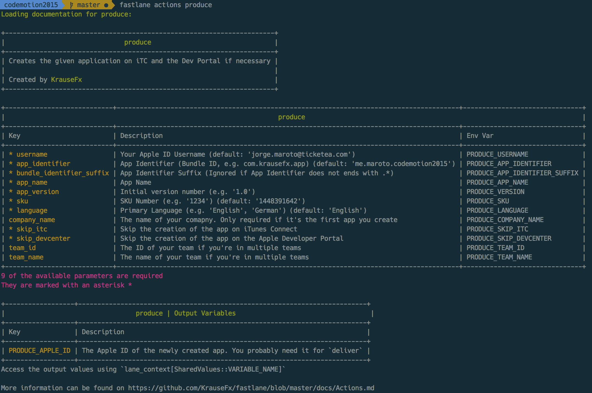

^ produce se puede utilizar también mediante una acción


---

# Fastfile

```ruby

  lane :create_app do
    # be carefull with produce action, because apps created
    # can't be deleted from iTunes Connect (thanks Apple)

    produce(
      app_identifier: 'me.maroto.codemotion20152',
      app_name: 'prueba codemotion',
      language: 'Spanish',
      app_version: '1.0',
      sku: 'CODE20155',
    ) # if SKU is not specified, it will use a random one
  end


```

^ tampoco tiene mucho sentido crear una acción para esto pq solo se va a hacer una vez, además, hay que tener cuidado con ello :)


---


^ estas tres utilidades son para manejar los provisionings, actualizar los certificados, o generar los certificados de push de forma automática.

^ es algo que tampoco hago de forma repetitiva, por lo que lo utilizo también por línea de comandos en vez de con una acción


---

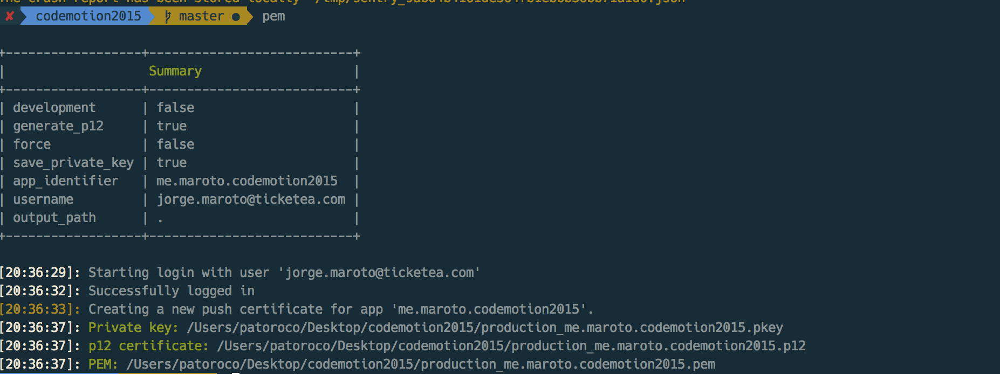

---

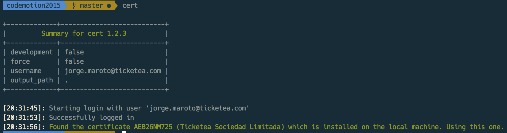

---

# Fastfile

```ruby
 desc "Update certificates and use it on provisioning profiles"
 lane :update_certs do
   cert
   sigh(force: true)
 end

 desc "Enable push if is needed"
 lane :enable_push do
   pem
   sigh(force:true)
 end

```

---


---


# Gymfile

```ruby

clean true
silent true

buildlog_path './fastlane/logs/'
output_directory "./fastlane/builds"

```

---

# Fastfile

```ruby

 desc "Create an ipa with Debug configuration"
 lane :ipa_debug do
   gym(
     configuration: 'Debug',
     output_name: 'codemotion-debug.ipa'
   )
 end
 
 desc "Create an ipa with Release configuration"
 lane :ipa_release do
   gym(
     configuration: 'Release',
     output_name: 'codemotion-release.ipa'
   )
 end
 
```

^ reemplaza a shenzen de @mattt en nomad, con el que haríamos `ipa( configuration: "Crashlytics" )`

---


---

# SnapshotHelper.swift

```swift
import Foundation
import XCTest

var deviceLanguage = ""

func setLanguage(app: XCUIApplication)
{
    Snapshot.setLanguage(app)
}

func snapshot(name: String, waitForLoadingIndicator: Bool = false)
{
    Snapshot.snapshot(name, waitForLoadingIndicator: waitForLoadingIndicator)
}


@objc class Snapshot: NSObject
{
    class func setLanguage(app: XCUIApplication)
    {
        let path = "/tmp/language.txt"

        do {
            let locale = try NSString(contentsOfFile: path, encoding: NSUTF8StringEncoding) as String
            deviceLanguage = locale.substringToIndex(locale.startIndex.advancedBy(2, limit:locale.endIndex))
            app.launchArguments += ["-AppleLanguages", "(\(deviceLanguage))", "-AppleLocale", "\"\(locale)\"","-ui_testing"]
        } catch {
            print("Couldn't detect/set language...")
        }
    }
    
    class func snapshot(name: String, waitForLoadingIndicator: Bool = false)
    {
        if (waitForLoadingIndicator)
        {
            waitForLoadingIndicatorToDisappear()
        }
        print("snapshot: \(name)") // more information about this, check out https://github.com/krausefx/snapshot
        
        sleep(1) // Waiting for the animation to be finished (kind of)
        XCUIDevice.sharedDevice().orientation = .Unknown
    }
    
    class func waitForLoadingIndicatorToDisappear()
    {
        let query = XCUIApplication().statusBars.childrenMatchingType(.Other).elementBoundByIndex(1).childrenMatchingType(.Other)
        
        while (query.count > 4) {
            sleep(1)
            print("Number of Elements in Status Bar: \(query.count)... waiting for status bar to disappear")
        }
    }
}

```

^ habría que incluir el fichero SwiftHelper.swift, que lo genera fastlane

---

# Snapfile

```ruby
# A list of devices you want to take the screenshots from
devices([
    "iPhone 6",
    "iPhone 6 Plus",
    "iPhone 5",
    "iPhone 4s",
])

languages([
  "en-US",
  "fr-FR",
  "es-ES"
])

# The name of the scheme which contains the UI Tests
scheme "codemotion2015UI"

# Where should the resulting screenshots be stored?
output_directory "./fastlane/screenshots"

```


---

# UITest

```swift

import XCTest

class codemotion2015UITests: XCTestCase {
        
    override func setUp() {
        super.setUp()
        let app = XCUIApplication()
        setLanguage(app)
        app.launch()
    }
    
    func testSnapshot() {
        snapshot("01Main")
        XCUIApplication().buttons.elementBoundByIndex(0).tap()
        snapshot("02Language")
    }
}

```

^ después en nuestro lado, tenemos que crear un target de test de interfaz con el método snapshot se guardará una captura de pantalla


---


# Fastfile

```ruby

  lane :generate_snapshots do
    snapshot(
      clear_previous_screenshots: true,
    )
  end


```


---

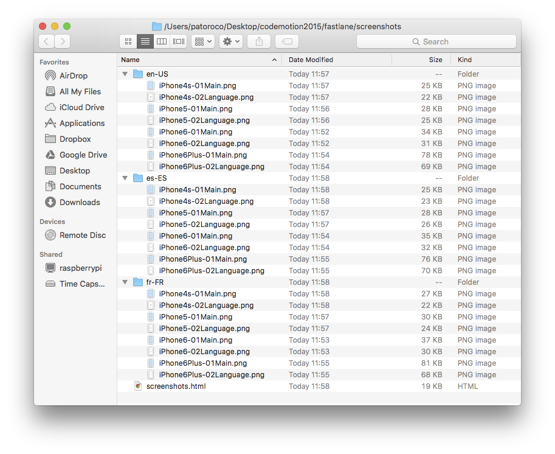

---


### `$ frameit`

<sub>https://developer.apple.com/app-store/marketing/guidelines</sub>

^ hay que bajarse las plantillas

---

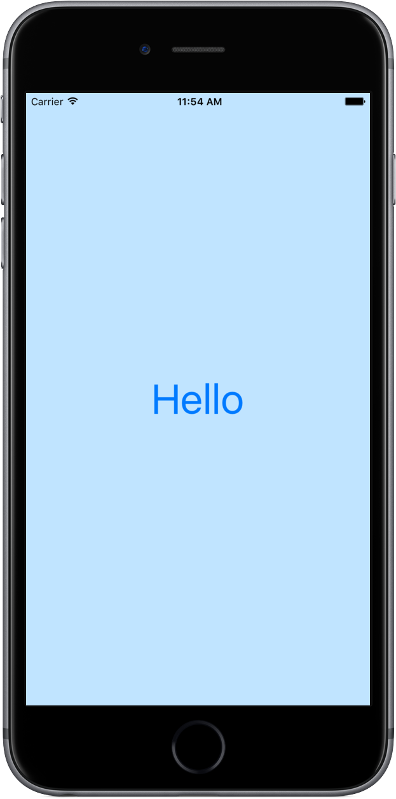

---


---


---


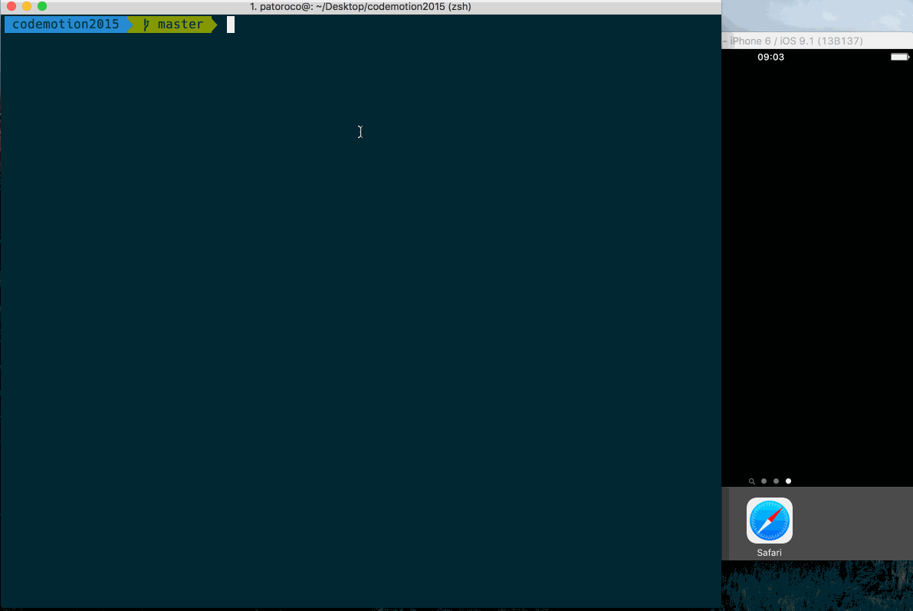

^ scan ejecuta los tests


---


---

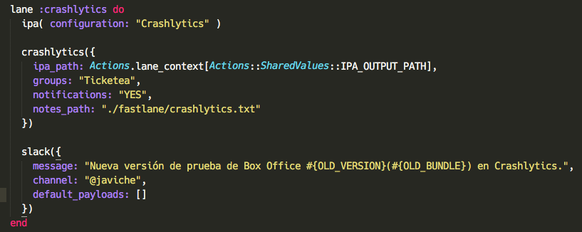

^ lo enseñé al principio, y ahora vamos a verlo en un caso real

^ pasar rápido estas imágenes pq se van a enseñar de verdad en sublime

---


---

#[fit]Demo

^ enseñar el caso de boxoffice con sus archivos


---


---

# Features

- upload build
- list builds
- manage test users

^ para subir una build yo uso deliver tal cual


---

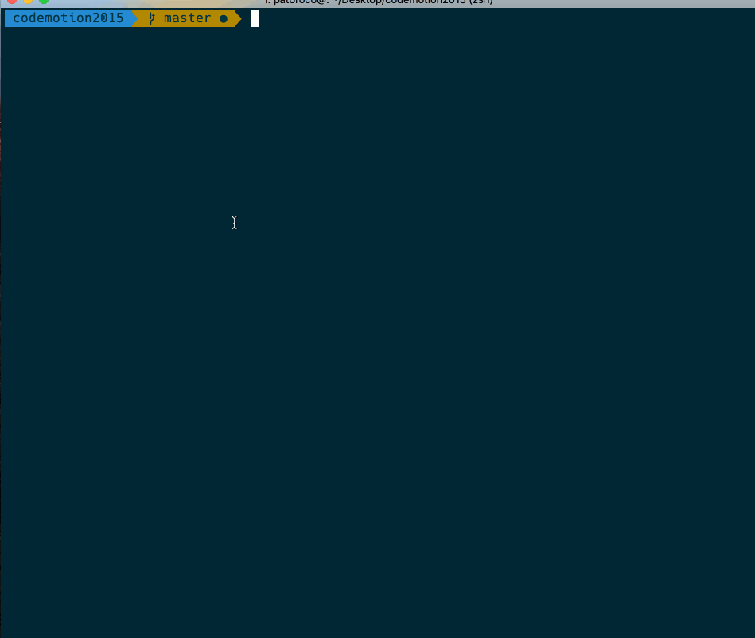

--- 


^ crea una web para que los usuarios se subscriban para el test. Aún no la he usado por cómo usamos el testing internamente.

---

# How


---


^ este gif que tiene en el repo del proyecto explica cómo funciona


---


^ para android. No lo he usado aún


---

# Links

- https://fastlane.tools/
- https://github.com/fastlane/***
- https://github.com/patoroco/codemotion2015


---

#[fit]Thanks

--
--

Jorge Maroto García
*@patoroco*

